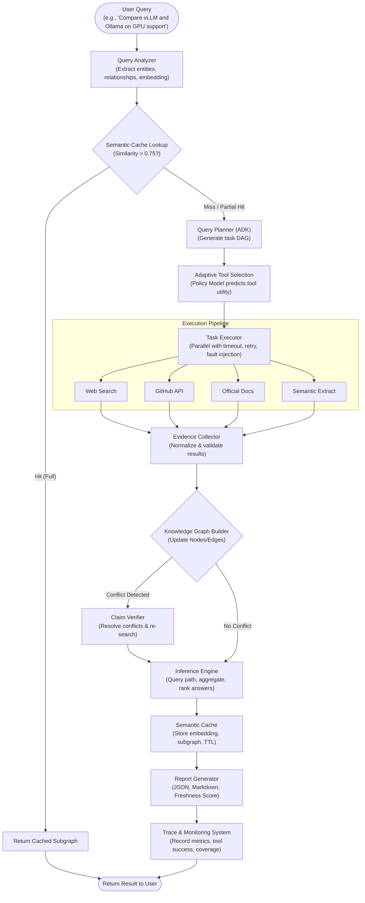

# Agent-as-Database: Architecture Diagram

Below is the Mermaid architecture diagram for the **Agent-as-Database: Semantic Knowledge Graph Query Engine**.

```mermaid
flowchart TD
    UserQuery(["User Query\n(e.g., 'Compare vLLM and Ollama on GPU support')"]) --> Analyzer["Query Analyzer\n(Extract entities, relationships, embedding)"]
    
    Analyzer --> CacheLookup{"Semantic Cache Lookup\n(Similarity > 0.75?)"}
    
    CacheLookup -- "Hit (Full)" --> CacheResult["Return Cached Subgraph"]
    CacheResult --> EndProcess(["Return Result to User"])
    
    CacheLookup -- "Miss / Partial Hit" --> Planner["Query Planner (ADK)\n(Generate task DAG)"]
    
    Planner --> ToolSelector["Adaptive Tool Selection\n(Policy Model predicts tool utility)"]
    
    ToolSelector --> Executor["Task Executor\n(Parallel with timeout, retry, fault injection)"]
    
    subgraph Execution Pipeline
        Executor --> Tool1["Web Search"]
        Executor --> Tool2["GitHub API"]
        Executor --> Tool3["Official Docs"]
        Executor --> Tool4["Semantic Extract"]
    end
    
    Tool1 & Tool2 & Tool3 & Tool4 --> Collector["Evidence Collector\n(Normalize & validate results)"]
    
    Collector --> GraphBuilder{"Knowledge Graph Builder\n(Update Nodes/Edges)"}
    
    GraphBuilder -- "Conflict Detected" --> Verifier["Claim Verifier\n(Resolve conflicts & re-search)"]
    Verifier --> InferenceEngine
    
    GraphBuilder -- "No Conflict" --> InferenceEngine["Inference Engine\n(Query path, aggregate, rank answers)"]
    
    InferenceEngine --> CacheStore["Semantic Cache\n(Store embedding, subgraph, TTL)"]
    
    CacheStore --> ReportGen["Report Generator\n(JSON, Markdown, Freshness Score)"]
    
    ReportGen --> Monitoring["Trace & Monitoring System\n(Record metrics, tool success, coverage)"]
    
    Monitoring --> EndProcess
```
