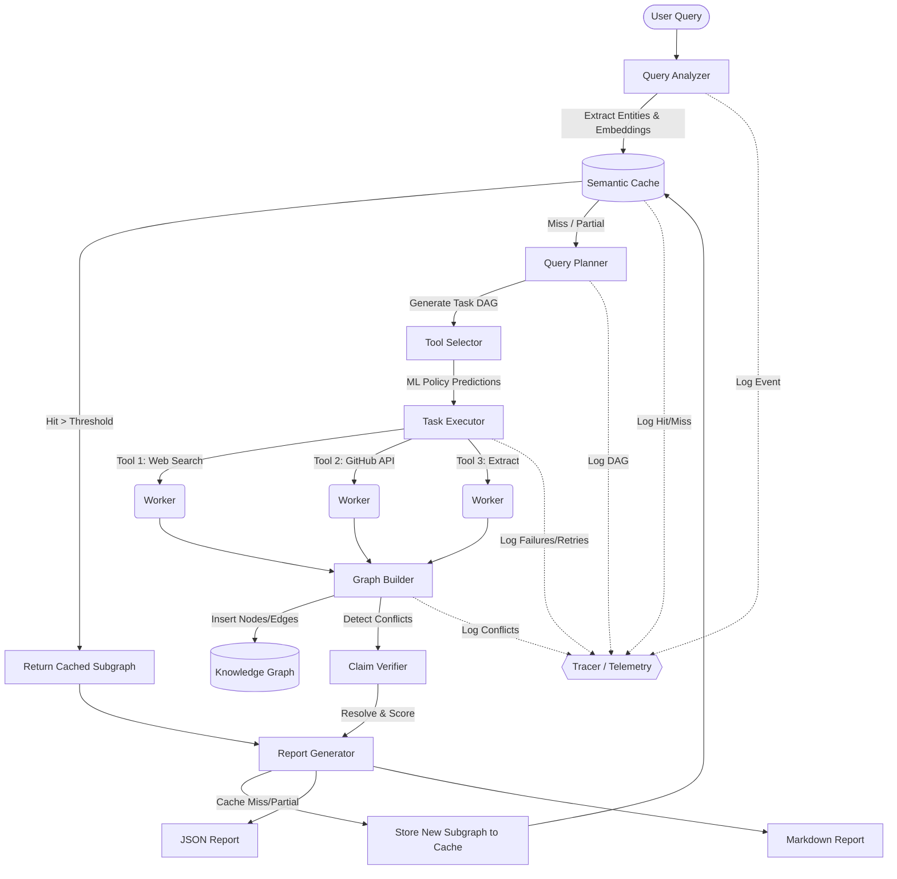

# Architecture Diagram: Agent-as-Database

The following diagram illustrates the data flow and core components of the Agent-as-Database system:

### Component Details
- **Query Analyzer**: Uses SpaCy for NLP extraction and sentence-transformers for vector embeddings.
- **Semantic Cache**: Redis-backed cache that matches identical semantic intents using cosine similarity (e.g. `Similarity > 0.75`).
- **Query Planner**: Decomposes intents into an acyclic graph of actionable tool requests.
- **Task Executor**: A robust tool runner that implements exponential backoff, fault-injection, and fallback strategies.
- **Knowledge Graph**: A `NetworkX` directed graph that tracks entity relationships and monitors edge-level contradictions.
- **Tracer**: Observability module logging structured telemetry for cache hit rates and system performance monitoring.
